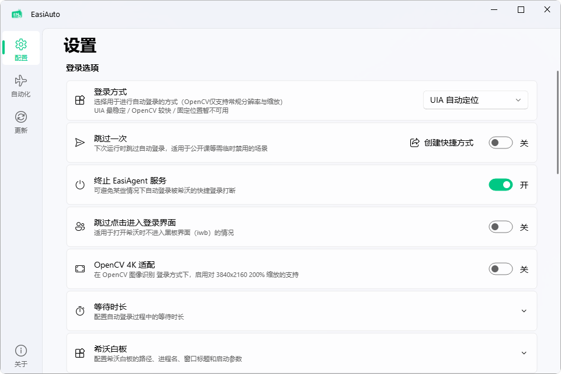
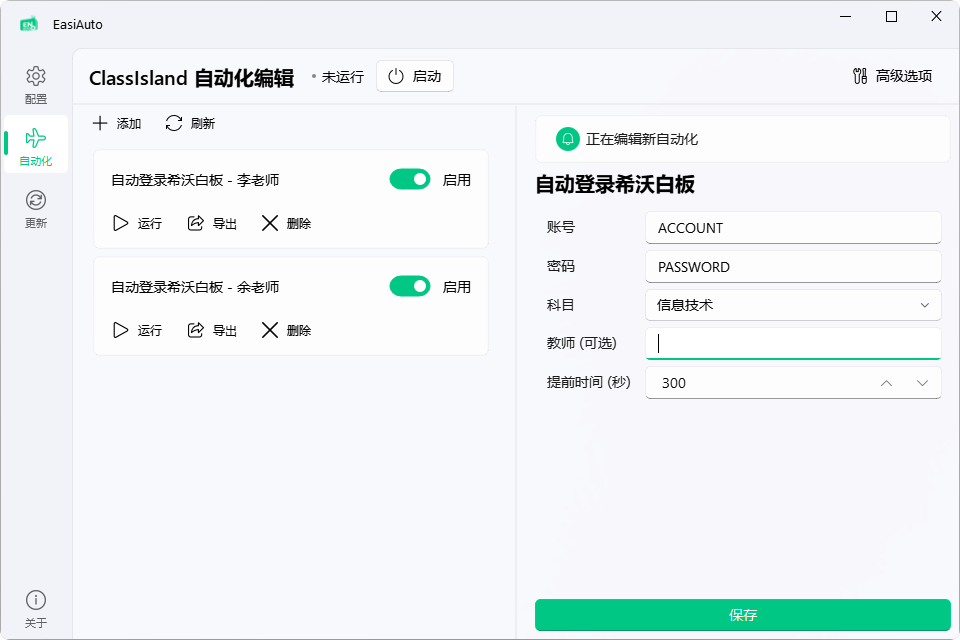
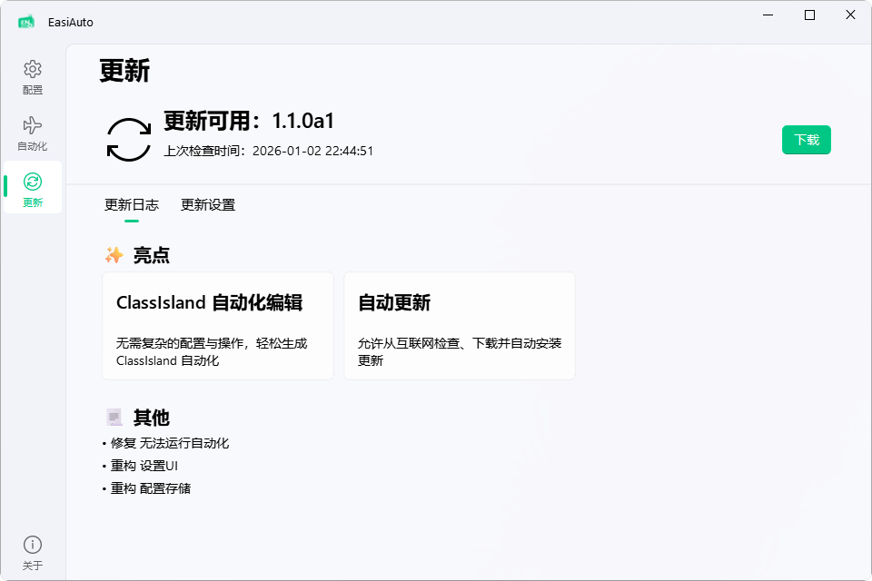

# EasiAuto


EasiAuto 是一款自动登录希沃白板的小工具，通过模拟登录流程来实现自动登录。

推荐同时安装 [ClassIsland](https://github.com/ClassIsland/ClassIsland/)，在指定课程开始时自动执行登录任务，实现全自动登录的智慧教学新体验。可在软件的「自动化」界面中快速配置自动化。

系统需求：Windows 10 及以上版本 | [下载](https://github.com/hxabcd/EasiAuto/releases/latest)

> [!NOTE]
> 更多细节，参见：<https://forum.smart-teach.cn/d/1039>

## ✨亮点

* **易用的设置界面**：前所未有的 ClassIsland 自动化编辑体验，简单几步即可配置完成

* **完备的登录方式**：具有固定位置、图像识别、自动定位 三种登录方案，根据需求灵活切换

* **运行前显示警告弹窗**：自动运行不再措不及防，还可暂时推迟登录


* **醒目的横幅警示**：兼具实用性与视觉冲击力，同时支持高度自定义


* **单次跳过**：暂时禁用自动登录，满足特殊场景下的灵活需求

* **错误重试**：无惧登录流程被打断

* **自动更新**：及时接收功能增强和问题修复

## 🖼️ 截图

<details>

  <summary>点击展开</summary>







</details>

## 🪄 使用

双击 EasiAuto.exe，打开设置界面进行配置，在自动化页添加档案并按需创建快捷方式到桌面。

此外，通过命令行进行调用的方法如下：

```pwsh
# 运行自动登录
.\EasiAuto.exe login -a ACCOUNT -p PASSWORD

# 跳过下一次登录
.\EasiAuto.exe skip

# 查看完整使用说明
.\EasiAuto.exe -h
```
